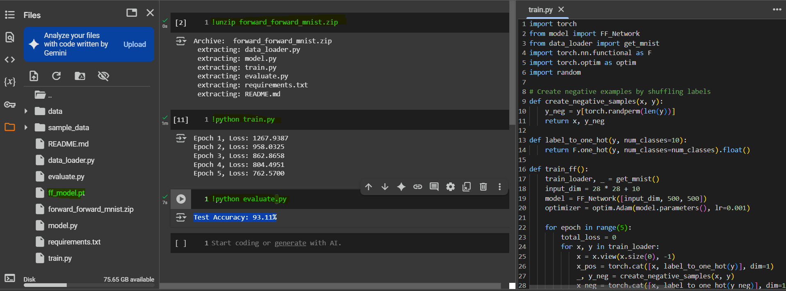

# Forward-Forward Neural Network on MNIST

<p align="center">
  
</p>


## 🧠 Forward-Forward Neural Network on MNIST (Made Simple)

This project shows how to train a neural network **without using backpropagation**. Instead, it uses a new idea called the **Forward-Forward algorithm**, introduced by Geoffrey Hinton. The goal is to recognize handwritten digits (0 to 9) from the MNIST dataset.

---

## 🔧 How It Works (In Simple Terms)

Instead of using gradients like regular neural networks, this method uses a **trick**:
- It shows the network two versions of each image:
  - A **positive sample**: the image with the **correct label**.
  - A **negative sample**: the image with a **wrong label**.
- The network tries to **like** the positive ones and **dislike** the negative ones.
- It learns by comparing the two, not by calculating gradients backward.

This process is called **contrastive learning**.

---

## 🧱 What’s Inside the Project

- `data_loader.py`: Loads the MNIST images.
- `model.py`: Builds the Forward-Forward network (no backprop).
- `train.py`: Teaches the model using positive and negative pairs.
- `evaluate.py`: Tests how well the model can recognize digits.
- `requirements.txt`: List of Python libraries needed.
- `README.md`: You're reading it!

---

## 🚀 How To Run It

### Train the Model:
```bash
python train.py
```

### Test the Model:
```bash
python evaluate.py
```

---

## 📊 Sample Output

```
Epoch 1, Loss: 1267.9387
Epoch 2, Loss: 958.0325
Epoch 3, Loss: 862.8658
Epoch 4, Loss: 804.4951
Epoch 5, Loss: 762.5700
Test Accuracy: 93.11%
```

---

## 🤔 Why Is The Loss High?

The **loss values look high** (e.g. 1200+ at the start), but **that’s normal** in the Forward-Forward algorithm. Here’s why:

1. **The loss is not a regular cross-entropy or MSE** — it's based on how much the model can **separate** positive and negative samples using a custom "goodness" score.
2. The numbers are bigger because it's summing values across **many neurons and layers**.
3. Even though the loss is high, it’s **decreasing**, which means the model **is learning**.
4. The test accuracy (~93%) shows the model works well — so don’t worry about the raw loss numbers being big.

---

## 🧠 Model Structure

- Input: 784 pixels (28x28 image) + 10 for label → total 794
- Hidden Layers: Two layers with 500 neurons
- Activation: ReLU
- Optimizer: Adam

---

## ✅ Results

With just 5 epochs of training, we reach **93% accuracy** — not bad for a model that doesn’t use backpropagation!

---

## 📈 How To Improve It

- Train for more epochs
- Try deeper or wider networks
- Tune learning rate or batch size
- Try better ways of creating negative samples

---
